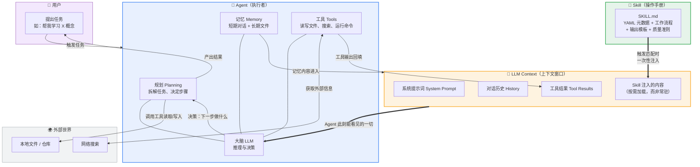
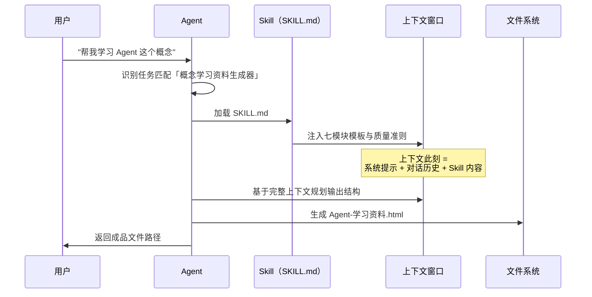

# 概念关系：Agent、大模型上下文（LLM Context）、Skill

## 一句话总览

> **Agent** 是会思考、会用工具的"执行者"；**大模型上下文（LLM Context）** 是它思考时能"看见"的信息空间；**Skill** 是预先写好、按需加载进这个空间的专业操作手册。

三者不是并列的三个功能，而是一个分层协作系统：**Skill 决定"往上下文里放什么"，上下文决定"Agent 此刻知道什么"，Agent 决定"用这些知识做什么"。**

---

## Mermaid 关系图

**读图要点**：Skill 和记忆、工具结果一样，最终都要**进入上下文窗口**才能被 Agent 使用——Skill 不是独立运行的程序，而是一段"被按需加载的知识"。

---

## 两两关系辨析

### 1️⃣ Agent ↔ LLM Context：演员与舞台

| 维度 | Agent | LLM Context |
|------|-------|-------------|
| 角色 | 决策与行动的主体 | 决策时可见的信息空间 |
| 生命周期 | 贯穿整个任务 | 每轮推理时被重新组装 |
| 类比 | 厨师 | 厨师眼前的操作台 |

- Agent 每一步"思考"，本质上都是把**当前上下文**发给大模型，得到下一步动作。
- **上下文是 Agent 的硬边界**：没进上下文的信息，Agent 不知道——这就是为什么需要记忆管理、RAG、Skill 按需加载等机制。
- 上下文不是越大越好：塞入无关信息会引发"大海捞针"效应，降低推理质量并增加成本（注意力计算随长度平方级增长）。

### 2️⃣ Agent ↔ Skill：专家与操作手册

| 维度 | Agent | Skill |
|------|-------|-------|
| 角色 | 通用执行者 | 领域专用的流程与规范 |
| 生效方式 | 常驻运行 | 触发条件匹配时才加载 |
| 解决的问题 | "会做任何事"但可能不专业 | 让它"在特定场景做得专业" |

- Agent 是"什么都懂一点的全科医生"，Skill 是各科室的**标准诊疗流程**：触发场景（患者症状）匹配时，手册被翻开并遵循执行。
- Skill 把"专家经验"固化下来：工作流程、输出模板、质量准则，避免每次都靠 Agent 自由发挥。
- 反向依赖：Skill 本身不能运行，它必须被 Agent 加载进上下文后才产生作用。

### 3️⃣ LLM Context ↔ Skill：桌面与手册

| 维度 | LLM Context | Skill |
|------|-------------|-------|
| 角色 | 每次推理的临时信息空间 | 可复用的持久化知识资产 |
| 占用 | 常驻消耗 token | 平时零占用，触发时注入 |
| 类比 | 工作台桌面 | 从书架上抽出来的操作手册 |

- Skill 的核心价值在于**上下文经济学**：把专业知识存在上下文之外（磁盘上的 SKILL.md），需要时才加载，避免长期占用窗口。
- Skill 的 YAML 元数据（name、description）会先被索引，正文按需加载——这正是为了不浪费上下文空间。

---

## 用本仓库的实际例子串起来

以本仓库的「概念学习资料生成器」Skill 为例，一次完整调用中三者如何协作：

**分工一目了然**：

- **Agent**（我，WorkBuddy）判断该用哪个 Skill、如何组织生成、把文件写到哪里；
- **Skill**（概念学习资料生成器）提供"一份合格学习资料长什么样"的专业模板；
- **LLM Context** 是两者相遇的场所——Skill 内容被注入后，Agent 的每一步生成都"看着"这份模板进行。

---

## 常见误解速查

| 误解 | 事实 |
|------|------|
| "Skill 是一个独立运行的插件/程序" | Skill 是结构化文本，必须被 Agent 加载进上下文才生效 |
| "上下文越大，Agent 越聪明" | 无关信息过多会稀释注意力，质量反而下降 |
| "Agent 记得所有历史对话" | 只记得当前上下文内的内容，跨会话要靠持久化记忆文件 |
| "Skill 会一直占用模型能力" | 按需加载，未触发时几乎零成本 |

---

## 我的思考

我觉得这三个概念是层层递进的关系。Agent 是"执行者"，它依赖大模型的上下文来理解任务，而 Skill 则是让 Agent 更高效的"工具包"。最让我意外的是，Skill 可以弥补大模型"记不住"的问题，把重复的流程固化下来，这让我对 AI 的可定制性有了更深的理解。

---

*本文档配合 `learning-materials/` 下的三份学习资料阅读，三者关系的详细单概念解释见对应 HTML 文件。*
